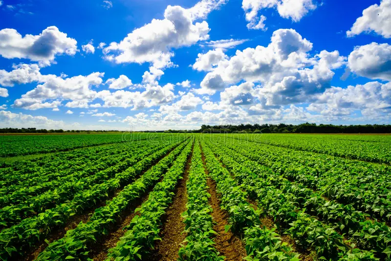
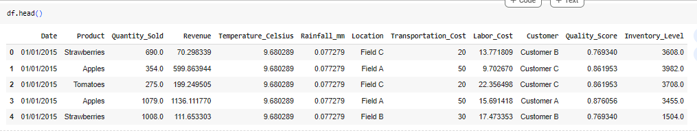

# Agricultural-Product-Distribution: Forecasting-Predicting-Demand-to-Optimize-Harvest-Schedules-

## Description:
- The focus of the project is forecasting, demand, and sales.
-	Business Structure: Agricultural Industry
This project aims to develop predictive models using Python for forecasting the demand for agricultural products. 
Optimizing harvest schedules based on these demand predictions and implementing effective distribution strategies to ensure efficient allocation of resources.
 
## Learning Skills: 
-	Python
-	Data Processing
-	Exploratory Data Analysis
-	Forecasting
-	Modelling

## Key learning :
- Business Introduction:
-	Business Overview/Problem
-	Rationale for project
-	Aim of the project
-	Data Description
-	Tech Stack
-	Project Scope
-	Data Exploration and Understanding

## Business Introduction:
Green Harvest Farms is a well-established enterprise with a rich history dating back to its founding in 2005. Situated in Abuja, Green Harvest Farms is strategically located in one of Nigeria's most prolific agricultural regions.
The company’s geographical advantage ensures access to prime farmland and ideal growing conditions, including abundant sunlight, fertile soil, and a reliable water supply from nearby rivers and aquifers.
At its core, Green Harvest Farms is guided by a set of core values that emphasize sustainability, quality, and innovation. The company’s mission is to provide consumers with the freshest, highest-quality agricultural products while minimizing its environmental impact and contribution to the local economy. Their agricultural portfolio includes fruits and vegetables. And herbs.

## Business Overview/Problem
Green Harvest Farms faces a critical business challenge related to optimizing harvest schedules and distribution. The primary issues the company encounters include:
-	**Inefficient Harvesting:** The current harvesting process is primarily based on traditional seasonal patterns and historical data, resulting in inefficiencies. This approach leads to underutilization of resources during peak seasons and overproduction during off-peak times.

-	**Demand Variability:** The demand for agricultural products fluctuates due to factors such as weather conditions, consumer preferences, and market trends. Green Harvest Farms often struggles to accurately predict these variations, leading to issues with overstocking or understocking products.

-	**Shelf-Life Management:** Different crops have varying shelf lives, and ensuring products reach customers at their peak freshness is a challenge. Misjudging harvest times can lead to product wastage and reduced profits.

-	 **Transportation Optimization:** The distribution network encompasses multiple destinations across the country. Finding the optimal routes and delivery schedules to minimize transportation costs while meeting demand is a complex problem.

## Rationale for the Project: 
Why production distribution forecasting?
Production Distribution Forecasting is a data science technique that helps farmers predict the optimal time to harvest their crops. The significance of initiating the Agricultural Product Distribution Forecasting project at Green Harvest Farms is underscored by several compelling reasons:

-	** Enhancing Efficiency:** Accurate demand forecasting and optimized harvest schedules will maximize resource utilization, leading to increased operational efficiency and cost savings.
-	**Reducing Food Waste:** By better predicting demand and harvest times, Green Harvest Farms can significantly reduce food waste, aligning with sustainability goals and minimizing environmental impact.
-	** Improved Profit Margins:** Efficient distribution, reduced wastage, and meeting customer demand translate into improved profit margins for the company.
-	 **Competitive Advantage:** Staying ahead of market demand trends and consistently delivering fresh produce will give Green Harvest Farms a competitive edge in the industry.

## Aim of the Project
The objectives of the Agricultural Product Distribution Forecasting project are as follows:
-	Develop a robust demand forecasting model that accurately predicts product demand based on historical data, weather conditions, and market trends.
-	Identify key parameters that affect production demand; To identify what part of the Agricultural company, and also factors affect production demand.
In order to help Green Harvest Farms better optimize production and Sales

## Data Description
The dataset available from the company contains the following information:
-	**Date:** Date of sale of product, which includes the day, month and year.
-	**Product:** The name of the agricultural product, which includes Apples, Strawberries, Tomatoes and others.
-	**Quantity Sold:** The quantity of the agricultural product sold for that particular date.

-	**Revenue:** Total revenue from the sale of the agricultural product in US dollars.

-	**Temperature:** The average temperature for the day in degree Celsius.

-	**Rainfall:** The amount of rainfall for that date, at the farm location in mm.

-	**Location:** This denotes the specific location or field where an agricultural product was harvested.

-	**Transportation Cost:** The total cost of transportation from storage to the buyer.

-	 **Labor Cost:** The estimated cost of producing that amount or quantity of produce.

-	**Customer:** An Anonymized ID; (Not included in the original dataset), of a particular customer who bought agricultural product

-	**Quality Score (between 0 and 1):** This measures the quality of the product. This measure is calculated using a variety of metrics, i.e. the weight of product, defects or no defects, ripeness, sweetness, etc.

-	**Inventory Level:** The quality of a particular agricultural produce in stock each day.

## Tech Stack
-	Pandas for data manipulation
-	NumPy for computations
-	SciPy for computation
-	Matplotlib for plotting graphs
-	Seaborn for plotting graphs
-	Statsmodels for statistical analysis, and computations
-	 Prophet a machine learning model
-	Scikit-learn contains multiple models to choose from with also evaluating models)

## Project Scope
-	**Data Collection:** Gather historical sales, weather, shelf life, transportation, and customer data from various sources

-	**Data Processing:** Clean, transform and preprocess the data, handling missing data and outliers, ensure data is properly prepared

-	**Exploratory Data Analysis:** Explore the data to identify trends, correlations, and seasonality, the features in the data, relationship between datasets, understanding the data

-	**Feature Engineering:** Create relevant features for demand forecasting and optimization models, adjusting and creating some features.

-	**Demand Forecasting Model:** Develop ML models to predict product demand accurately(Building multiple machine learning prediction models, trying  and evaluating them)

-	**Model Evaluation:** Assess model performance using multiple metrics(Evaluating all models and see which works best)

## Data Exploration and Understanding
To understand the dataset, focusing on reviewing the contents, patterns, features, and relationship between the features.
Data Exploration and Understanding
In this section, we are spending time on the dataset to understand the basics of the data. We are focusing on reviewing the contents, patterns, features, and the relationships between these features.
Some of the things we are doing in this section include:
•	Understanding the basic statistics like mean, median, standard deviation, etc., of the dataset; this is helping us know how the values in our dataset are distributed.
•	Checking for missing values and handling them if there are any; this is ensuring that when we perform some manipulations on the dataset later on, we are not running into errors that occur because of missing values, such as TypeError and ValueError.
•	Performing visualizations to show patterns, seasonality, and trends; this is important because it is also helping us to understand our dataset.
•	Checking for correlations so that we can see which features tend to affect sales and their quantities.
•	Performing univariate, bivariate, multivariate, and temporal analysis.
NOTE: We are not removing duplicates here because it is possible for two equal transactions to happen on the same day from the same customer. So, if we try to remove duplicate data, we may just cause problems for ourselves by removing relevant data.

See the first five rows of the data, to get a glimpse of its content.

##
https://github.com/EngrIBGIT/Agricultural-Product-Distribution-Forecasting-Predicting-Demand-to-Optimize-Harvest-Schedules-/blob/main/Agricultural_Product_Distribution_Forecasting_Predicting_Demand_to_Optimize_Harvest_Schedules_and_Distribution.ipynb
##

##
